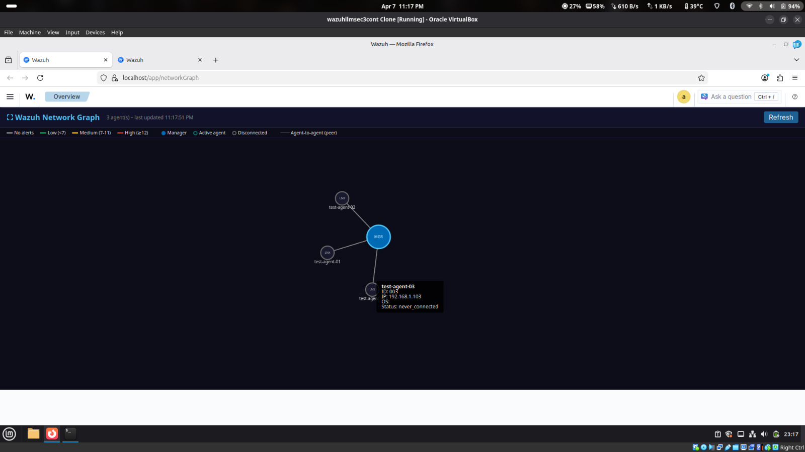

# networkGraph — Wazuh Network Topology Plugin

An OpenSearch Dashboards (OSD) plugin that renders a live, interactive D3.js force-directed graph showing every Wazuh agent connected to the manager, with edges colour-coded by real-time alert severity.

---

## What It Looks Like



*Screenshot: 3 test agents connected to the Wazuh Manager. The hover tooltip shows agent ID, IP, OS, and connection status. All edges are gray (no alerts active during this test). Note: screenshot pre-dates the 2026-04-23 light theme update — the canvas background is now `#f8fafc` (light grey).*

- **Manager node** — large blue circle labelled `MGR` at the centre
- **Agent nodes** — smaller circles labelled with OS type (`WIN`, `DEB`, `RPM`, `LNX`)
- **Edges** — coloured by the highest alert level seen in the last 5 minutes:

| Edge colour | Meaning | Rule level |
|-------------|---------|-----------|
| Gray | No recent alerts | — |
| Green | Low severity | < 7 |
| Yellow | Medium severity | 7–11 |
| Red | High severity | ≥ 12 |

- **Agent-to-agent edges** — dashed lines with arrowheads drawn when alerts contain matching src/dst IPs belonging to two enrolled agents (e.g. lateral movement, port scans)
- **Node outline** — teal = active agent, grey = disconnected agent

---

## Features

- Live polling every 10 seconds (automatic, no page refresh needed)
- **Position preservation** — node positions are saved before each poll and restored afterward; no respawn animation on refresh
- **Topology change detection** — simulation restart (alpha 0.1) only when nodes are added or removed; steady-state polls leave positions untouched
- **Smooth transitions** — new nodes fade in (400 ms), removed nodes fade out (400 ms), edge colour changes transition over 500 ms
- Manual Refresh button in the header bar
- Zoom and pan the graph canvas (mouse wheel + drag on background)
- Drag individual nodes to rearrange the layout
- Hover tooltip showing agent ID, name, IP, OS, and connection status
- Appears in the Wazuh Dashboard sidebar under **Threat Intelligence > Network Graph** (registered via `patch_plugin.py`)
- Sidebar entry uses `window.location.replace('/app/networkGraph')` to bypass Wazuh's hash router — clicking the entry navigates cleanly to the plugin
- No external network calls from the browser — all Wazuh API traffic goes through a server-side proxy route

---

## Architecture

```
Browser (D3 graph)
    │  GET /api/network_graph/agents
    │  GET /api/network_graph/alerts
    ▼
OSD Server-side plugin (Node.js)
    │  POST /security/user/authenticate?raw=true  (JWT)
    │  GET  /agents
    │  GET  /alerts
    ▼
Wazuh REST API  :55000  (HTTPS, self-signed cert)
```

The browser never talks directly to the Wazuh API. The OSD server plugin holds the Wazuh credentials and JWT token, acting as an authenticated proxy.

---

## File Layout

```
networkGraph/
├── opensearch_dashboards.json      ← OSD plugin manifest (id, version, server/ui flags)
├── package.json                    ← npm metadata and build script
├── webpack.config.js               ← webpack 5 build config (entry, output, fallbacks)
├── install.sh                      ← build + deploy script (run as root)
├── .gitignore                      ← excludes node_modules and package-lock.json
├── graphTest.jpg                   ← screenshot of the plugin running in the browser
├── networkGraph-plugin-log.md      ← full development log (research, bugs, decisions)
├── public/
│   ├── bundle_entry.js             ← webpack entry — registers with window.__osdBundles__
│   └── index.js                    ← all UI code (D3 graph, polling, layout, OSD class)
├── server/
│   ├── index.js                    ← OSD server entry (exports plugin factory)
│   ├── plugin.js                   ← NetworkGraphPlugin lifecycle class (setup/start/stop)
│   └── routes/
│       └── index.js                ← Wazuh API proxy routes + JWT token cache
└── target/
    └── public/
        └── networkGraph.plugin.js  ← pre-built webpack 5 bundle (~291 KB, D3 inlined)
```

---

## Installation

### Prerequisites

- Wazuh 4.14.3 all-in-one (manager + dashboard on the same host)
- Node.js ≥ 18 and npm (for building from source)
- `root` or `sudo` access

### Quick Install (pre-built bundle)

The `target/public/networkGraph.plugin.js` bundle is pre-built and checked into this repo. Run `install.sh` — it copies the existing bundle directly and skips the webpack step if the bundle is already present.

```bash
cd /path/to/networkGraph
sudo bash install.sh
```

### What install.sh Does

1. **Checks prerequisites** — verifies `node`, `npm`, and `python3` are on `$PATH`.
2. **Copies source to `/tmp/networkGraph-build/`** — avoids VirtualBox shared-folder (vboxsf) symlink restrictions that break `npm install`.
3. **Runs `npm install --legacy-peer-deps`** — installs D3 and webpack inside the build directory.
4. **Runs `npx webpack --mode production`** — produces `target/public/networkGraph.plugin.js` (~291 KB, D3 inlined).
5. **Copies runtime files** to `/usr/share/wazuh-dashboard/plugins/networkGraph/`:
   - `opensearch_dashboards.json` and `package.json` (plugin metadata)
   - `server/index.js`, `server/plugin.js`, `server/routes/index.js` (server-side proxy)
   - `target/public/networkGraph.plugin.js` (the browser bundle)
   - Writes `server/.env` with `WAZUH_API_PASSWORD` placeholder (skips if file exists)
6. **Fixes file ownership** — `chown -R wazuh-dashboard:wazuh-dashboard`.
7. **Removes the `/tmp` build directory**.
8. **Runs `patch_plugin.py`** — idempotent script that registers Network Graph in the Wazuh Threat Intelligence sidebar (`wazuh.plugin.js`).
9. **Regenerates compressed variants** — rewrites `wazuh.plugin.js.gz` (gzip -9) and `wazuh.plugin.js.br` (brotli) so OSD serves the patched file to all browsers.
10. **Restarts `wazuh-dashboard`** via `systemctl` and reports the service status (skipped with `--no-restart`).

---

## Configuration

Wazuh API credentials are stored in `server/.env` (written by `install.sh` on first run):

```
WAZUH_API_HOST=localhost
WAZUH_API_PORT=55000
WAZUH_API_USER=wazuh-wui
WAZUH_API_PASSWORD=
```

Set `WAZUH_API_PASSWORD` to the `wazuh-wui` password found in `wazuh-passwords.txt` (generated by the Wazuh installer). The `.env` file is not overwritten on reinstall, so credentials survive upgrades.

The `wazuh-wui` user is the built-in read-only API user created by Wazuh during installation.

---

## Accessing the Plugin

After installation, open the Wazuh Dashboard:

```
https://<your-host-ip>/app/networkGraph
```

Or navigate via the Wazuh sidebar: **Threat Intelligence > Network Graph**.

---

## Verification Commands

```bash
# Check the plugin is installed
ls /usr/share/wazuh-dashboard/plugins/networkGraph/

# Check dashboard service is running
systemctl status wazuh-dashboard

# Confirm server routes are registered (look for "networkGraph" in logs)
journalctl -u wazuh-dashboard --no-pager | grep networkGraph

# Test the proxy routes directly
curl -sk -u admin:<password> https://localhost/api/network_graph/agents | python3 -m json.tool
curl -sk -u admin:<password> https://localhost/api/network_graph/alerts | python3 -m json.tool
```

---

## Technical Notes

### Why a custom webpack build?

Wazuh Dashboard ships as a pre-compiled binary with no build toolchain exposed. There is no supported way to write a plugin using OSD's own build pipeline without the full OSD source tree. Instead, this plugin bundles all its dependencies (including D3 v7, ~270 KB) into a single self-contained file using webpack 5.

### The `window.__osdBundles__` registration system

OSD's browser runtime expects plugins to register themselves by calling:

```js
window.__osdBundles__.define(bundleId, requireFn, 0)
```

`bundle_entry.js` does this explicitly via `window.__osdBundles__` rather than a bare `__osdBundles__` reference. The bare form was the original bug — webpack 5's terser optimiser treated the bare global as dead code in a `typeof` guard and removed the `define()` call entirely, causing OSD to report "Definition of plugin 'networkGraph' not found". Using `window.*` property access prevents this optimisation.

### JWT token caching

The server-side proxy obtains a JWT from the Wazuh API on first use and caches it for 14 minutes (Wazuh's default token lifetime is 15 minutes). On expiry or a token-invalid error (Wazuh error code 6), the cache is cleared and a fresh token is fetched automatically.

---

## Versions Tested

| Component | Version |
|-----------|---------|
| Wazuh Manager | 4.14.3 |
| OpenSearch Dashboards | 2.19.4 |
| D3.js | 7.9.0 |
| webpack | 5.98.0 |
| Node.js (build) | 18+ |

---

## Development Log

See [`networkGraph-plugin-log.md`](networkGraph-plugin-log.md) for the full build history — research notes, OSD internals studied, bugs encountered and fixed, and a step-by-step trace of every decision made during development.
